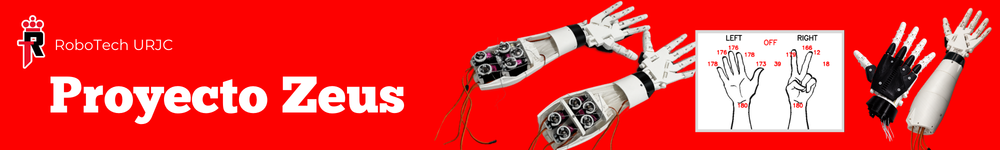

Este repositorio contiene el hardware, el software y la documentación necesarios para el proyecto **Mano de Zeus**, incluyendo información sobre su estado y progreso actuales.

---

## Sobre el proyecto

Mano de Zeus es un proyecto OpenSource desarrollado por la asociación **RoboTech de la URJC**. 

El proyecto está inspirado en **[InMoov](https://inmoov.fr/hand-and-forarm/)**, pero Mano de Zeus es una propuesta propia adaptada a nuestros objetivos y recursos. Así como la mano humana utiliza músculos y tendones para generar movimiento, Mano de Zeus emplea motores y hilos que replican esa misma lógica en una estructura robótica impresa en 3D.

---

## Hardware y Software

La estructura del robot está compuesta por piezas impresas en 3D, lo que hace que el proyecto sea accesible y fácilmente replicable. Los modelos y archivos necesarios para su construcción pueden encontrarse en la sección **[3D_model](https://github.com/RoboTech-URJC/Mano-Zeus/tree/main/3D_model)**.

El sistema de control se divide en dos partes principales:
- **Control de servomotores en Arduino**: código encargado de gestionar el movimiento de los dedos, permitiendo el control individual o conjunto de la mano. **[ServoMove](src/v2/ServoM)**
- **Seguimiento de mano con Python (OpenCV)**: sistema de visión que detecta la mano derecha mediante cámara, interpreta sus posiciones y traduce esa información en señales que posteriormente el Arduino ejecuta para replicar el movimiento en la mano robótica. **[Hand Tracking](src/v2/handTracking)**

De esta manera, el software interpreta el movimiento y el hardware lo ejecuta físicamente.

---
## Demostración
(progreso actual 24/02/2026)

  

